# Guía de Configuración y Programación del ESP32

## 1. Instalar el Driver del Puerto de Comunicación

1. **Conectar el ESP32** de la casa a la PC.
2. **Abrir la herramienta de Administración de equipos**.

   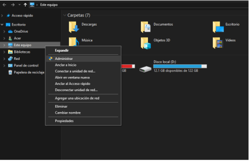

3. **Ir a Administrador de dispositivos**.

   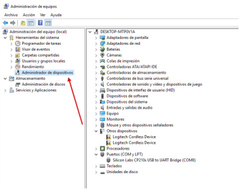

4. **Buscar en Puertos (COM y LPT)** el dispositivo conectado y dar en **Actualizar controlador**.

   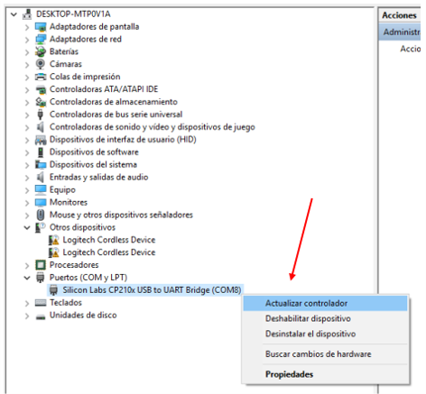

5. **Seleccionar la opción "Buscar software de controlador en el equipo"**.

   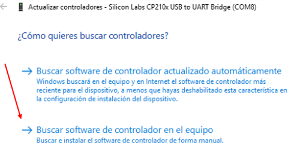

6. **Elegir la carpeta** `CP210x_Universal_Windows_Driver` proporcionada en los materiales de la clase.

   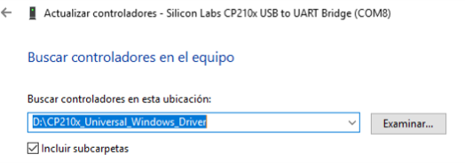

---

## 2. Instalar el IDE de Arduino

Instalar la **versión 1.8.19** proporcionada en la carpeta de la clase.

---

## 3. Instalar las Tarjetas de ESP32

1. **Ir a Preferencias**.

   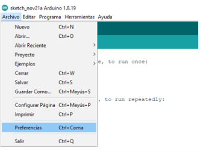

2. **Pegar las siguientes URLs** en el campo **Gestor de URLs Adicionales de Tarjetas** y presionar **OK**:

https://dl.espressif.com/dl/package_esp32_index.json http://arduino.esp8266.com/stable/package_esp8266com_index.json

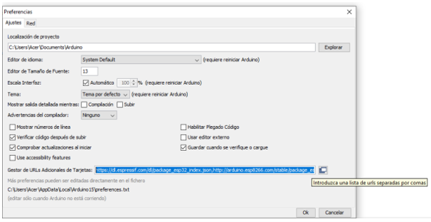

3. **Abrir el Gestor de Tarjetas**.

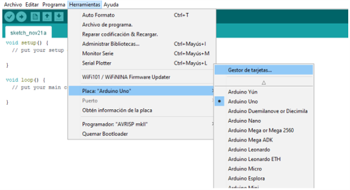

4. **Instalar las tarjetas de ESP32** brindadas por **Espressif Systems**.

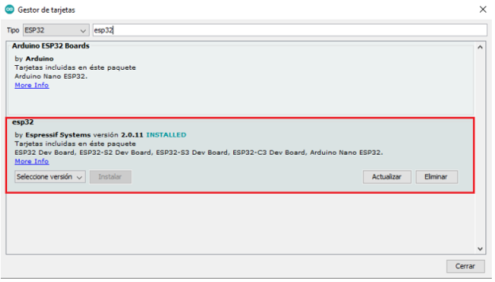

5. **Seleccionar la placa "ESP32 Dev Module"**.

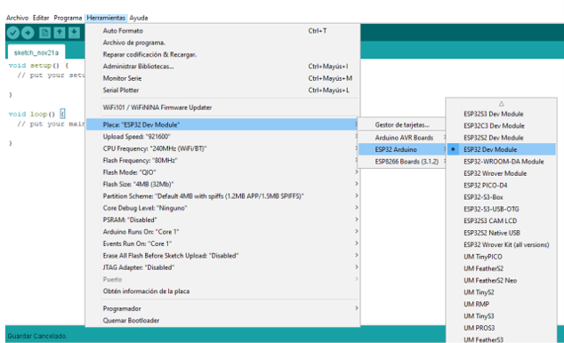

---

## 4. Instalar las Bibliotecas Necesarias

1. **Ir a Administrar bibliotecas**.

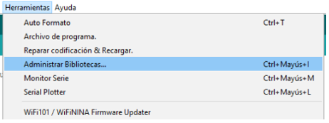

2. **Instalar las siguientes bibliotecas**:

- `ArduinoHttpClient`
- `Wifi`
- `ESP32Servo`
- `LiquidCrystalI2C`
- `ThingsBoard`

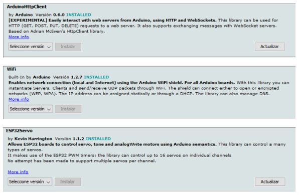
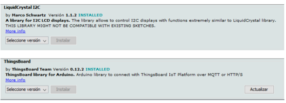

---

## 5. Ejecutar los Códigos de Prueba

1. **Código 1 - Sensores**:  
- Subir el código a la tarjeta.
- Este código recibe y muestra las mediciones de los sensores de la casa.
- Abrir el Monitor Serie para observar las mediciones de los 5 parámetros cada 3 segundos.

2. **Código 2 - Servo**:  
- Subir el código a la tarjeta.
- Este código acciona uno de los servomotores de la casa.
- Se puede modificar el pin que se vincula al objeto de la clase `Servo` para mover la puerta o la ventana:
  - Pin **18** para la ventana.
  - Pin **19** para la puerta.
- Observar cómo el servo se mueve escalonadamente en una dirección y luego regresa a su posición inicial en un solo movimiento. Este proceso se repite indefinidamente.

3. **Código 3 - PWM_LED**:  
- Subir el código a la tarjeta.
- Este código utiliza la salida con PWM del ESP32 para encender y apagar suavemente un LED (**efecto breathing light**).
- Se puede modificar el pin vinculado para accionar cualquiera de los 2 LEDs de la casa:
  - Pin **12** para el LED amarillo.
  - Pin **4** para el LED blanco.
- Observar cómo el LED comienza apagado y aumenta su intensidad hasta llegar a su máximo brillo, para luego disminuir su intensidad de manera continua hasta apagarse. Este proceso se repite indefinidamente.

4. **Código 4 - PWM_FAN**:  
- Subir el código a la tarjeta.
- Este código utiliza la salida con PWM del ESP32 para encender y apagar suavemente el ventilador de la casa.
- Observar cómo el ventilador comienza apagado y aumenta su velocidad hasta llegar a su máxima potencia, luego disminuye su velocidad hasta apagarse. Este proceso se repite indefinidamente.

5. **Código 5 - Passw**:  
- Subir el código a la tarjeta.
- Este código simula un sistema de autenticación para el hogar inteligente.  
  - El botón amarillo de la izquierda introduce la contraseña y el botón amarillo de la derecha representa el botón "Enter".
  - Una presión corta en el botón izquierdo representa el valor `"*"`, y una presión larga representa `"_"`.
  - La contraseña es: **`**_*`**.

> **Nota**: Los códigos pueden ser modificados para ejecutar otras acciones con los dispositivos conectados al hogar inteligente.
