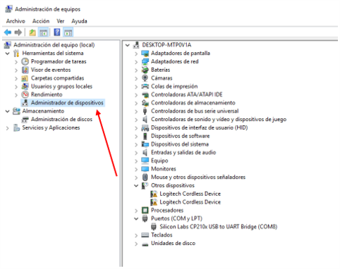
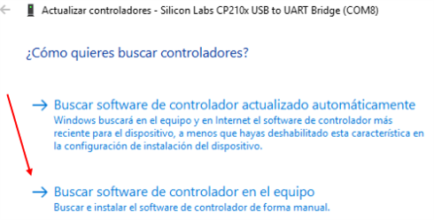
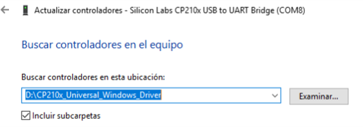
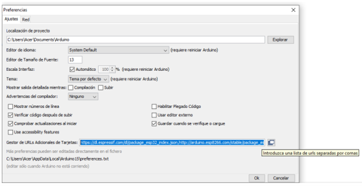
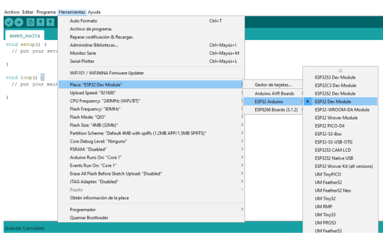
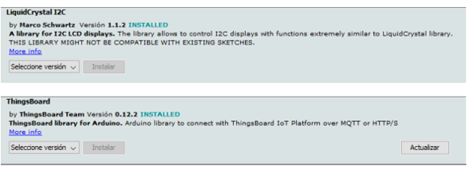

# Guía para Configurar y Programar el ESP32

## 1. Instalar el Controlador del Puerto de Comunicación

  Conecta el ESP32 a tu PC.

  Abre la herramienta de Administrador de Dispositivos.

  

  Navega hasta Administrador de Dispositivos.

  

  Busca el dispositivo conectado en Puertos (COM y LPT) y selecciona **Actualizar Controlador**.

  

  Elige la opción **Buscar software de controlador en el equipo**.

  

  Selecciona la carpeta `CP210x_Universal_Windows_Driver` proporcionada en los materiales de la clase.

  

---

## 2. Instalar el IDE de Arduino

  Instala la **versión 1.8.19** proporcionada en la carpeta de la clase.

---

## 3. Instalar las Tarjetas ESP32

  Ve a Preferencias.

  

  Pega las siguientes URLs en el campo **Gestor de URLs Adicionales de Tarjetas** y haz clic en **OK**:

  https://dl.espressif.com/dl/package_esp32_index.json http://arduino.esp8266.com/stable/package_esp8266com_index.json

  

  Abre el Gestor de Tarjetas.

  

  Instala las tarjetas ESP32 proporcionadas por **Espressif Systems**.

  

  Selecciona la placa "ESP32 Dev Module".

  

---

## 4. Instalar las Bibliotecas Requeridas

  Ve a Administrar Bibliotecas.

  

  Instala las siguientes bibliotecas:

  - `ArduinoHttpClient`
  - `Wifi`
  - `ESP32Servo`
  - `LiquidCrystalI2C`
  - `ThingsBoard`

  

  

---

## 5. Ejecutar los Códigos de Prueba

  ### Código 1 - Sensores
  - Sube el código al ESP32.
  - Este código recibe y muestra las mediciones de los sensores de la casa inteligente.
  - Abre el Monitor Serie para observar mediciones de 5 parámetros cada 3 segundos.

  ### Código 2 - Servo
  - Sube el código al ESP32.
  - Este código controla uno de los servomotores de la casa inteligente.
  - Puedes modificar el pin vinculado al objeto de la clase `Servo` para mover la puerta o la ventana:
  - Pin **18** para la ventana.
  - Pin **19** para la puerta.
  - Observa cómo el servo se mueve gradualmente en una dirección y luego regresa a su posición inicial. Este proceso se repite indefinidamente.

  ### Código 3 - PWM_LED
  - Sube el código al ESP32.
  - Este código utiliza la salida PWM del ESP32 para encender y apagar un LED de forma gradual (**efecto de luz respiratoria**).
  - Puedes modificar el pin vinculado para controlar uno de los LEDs:
  - Pin **12** para el LED amarillo.
  - Pin **4** para el LED blanco.
  - Observa cómo el LED se enciende gradualmente hasta alcanzar su máxima intensidad y luego se apaga lentamente. Este proceso se repite indefinidamente.

  ### Código 4 - PWM_FAN
  - Sube el código al ESP32.
  - Este código utiliza la salida PWM del ESP32 para encender y apagar el ventilador de forma gradual.
  - Observa cómo el ventilador aumenta su velocidad de forma progresiva hasta alcanzar su máxima potencia, y luego disminuye su velocidad hasta apagarse. Este proceso se repite indefinidamente.

  ### Código 5 - Passw
  - Sube el código al ESP32.
  - Este código simula un sistema de autenticación para la casa inteligente:
  - El botón amarillo izquierdo introduce la contraseña y el botón amarillo derecho actúa como el botón "Enter".
  - Una pulsación corta en el botón izquierdo representa `"*"`, y una pulsación larga representa `"_"`.
  - La contraseña es: **`**_*`**.

  > **Nota**: Estos códigos pueden modificarse para realizar otras acciones con los dispositivos conectados a la casa inteligente.
