# Guide for Configuring and Programming the ESP32
 

## 1. Install the Communication Port Driver

  Connect the ESP32 to your PC.

  Open the Device Manager tool.

  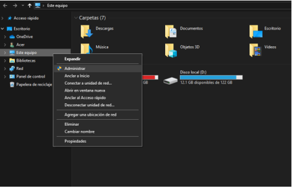

  Navigate to Device Manager.

  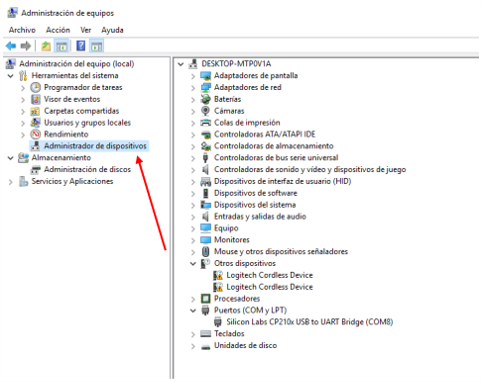

  Look under Ports (COM and LPT) for the connected device and select **Update Driver**.

  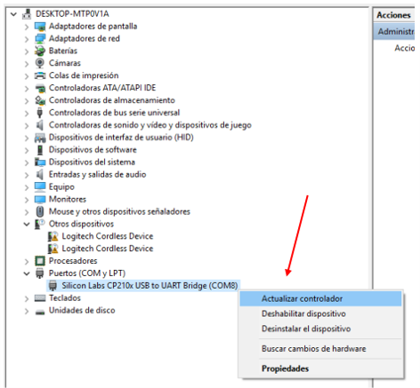

  Choose the option "Search for drivers on this computer"**.

  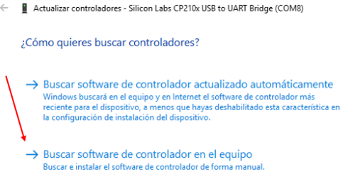
  
  Select the folder `CP210x_Universal_Windows_Driver` provided in the class materials.

  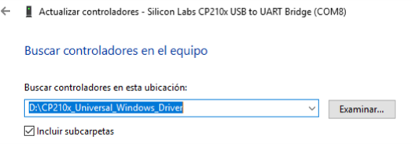

---

## 2. Install the Arduino IDE

  Install **version 1.8.19** provided in the class folder.

---

## 3. Install ESP32 Boards

  Go to Preferences.

  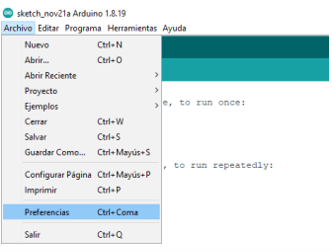

  Paste the following URLs into the **Additional Boards Manager URLs** field and click **OK**:

  https://dl.espressif.com/dl/package_esp32_index.json http://arduino.esp8266.com/stable/package_esp8266com_index.json

  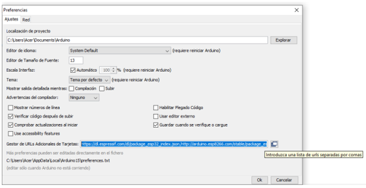

  Open the Boards Manager.

  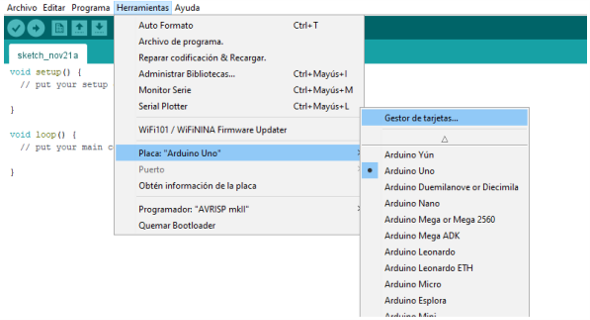

  Install the ESP32 boards provided by **Espressif Systems**.

  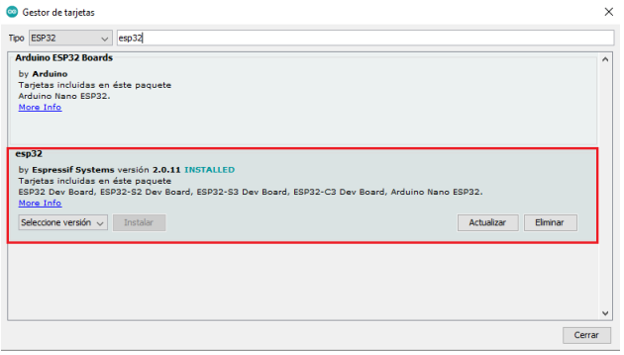

  Select the "ESP32 Dev Module" board.

  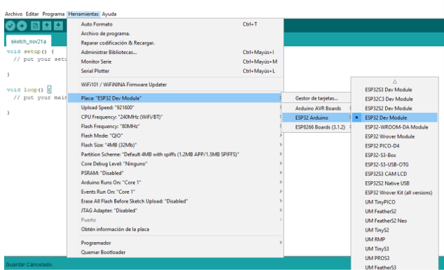

---

## 4. Install the Required Libraries

  Go to Manage Libraries.

  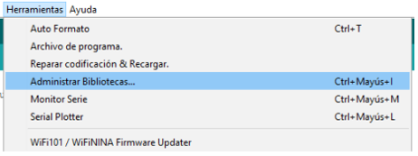

  Install the following libraries:

  - `ArduinoHttpClient`
  - `Wifi`
  - `ESP32Servo`
  - `LiquidCrystalI2C`
  - `ThingsBoard`

  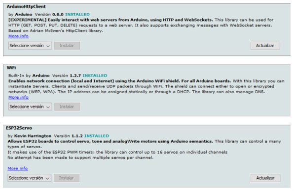

  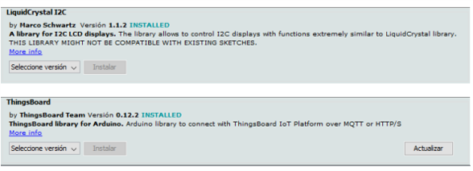

---

## 5. Run the Test Codes

  **Code 1 - Sensors**:  
  - Upload the code to the ESP32 board.
  - This code receives and displays sensor measurements from the smart home.
  - Open the Serial Monitor to view measurements of the 5 parameters every 3 seconds.

  **Code 2 - Servo**:  
  - Upload the code to the ESP32 board.
  - This code controls one of the smart home’s servomotors.
  - You can modify the pin linked to the `Servo` object to move the door or the window:
    - Pin **18** for the window.
    - Pin **19** for the door.
  - Observe how the servo moves incrementally in one direction and then returns to its initial position in a single movement. This process repeats indefinitely.

  **Code 3 - PWM_LED**:  
  - Upload the code to the ESP32 board.
  - This code uses the ESP32's PWM output to gradually turn a LED on and off (**breathing light effect**).
  - You can modify the pin linked to control either of the two LEDs in the smart home:
    - Pin **12** for the yellow LED.
    - Pin **4** for the white LED.
  - Observe how the LED starts off, gradually increases brightness to its maximum, and then dims back down. This process repeats indefinitely.

  **Code 4 - PWM_FAN**:  
  - Upload the code to the ESP32 board.
  - This code uses the ESP32's PWM output to gradually turn the fan on and off.
  - Observe how the fan starts off, gradually increases speed to its maximum, and then slows down until it stops. This process repeats indefinitely.

  **Code 5 - Passw**:  
  - Upload the code to the ESP32 board.
  - This code simulates an authentication system for the smart home.  
    - The left yellow button inputs the password, and the right yellow button acts as the "Enter" button.
    - A short press on the left button represents `"*"`, and a long press represents `"_"`.
    - The password is: **`**_*`**.

  > **Note**: These codes can be modified to perform other actions with the devices connected to the smart home.
