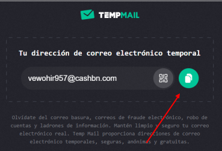
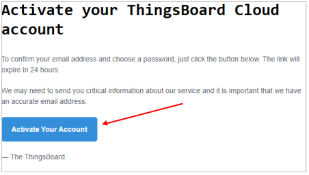
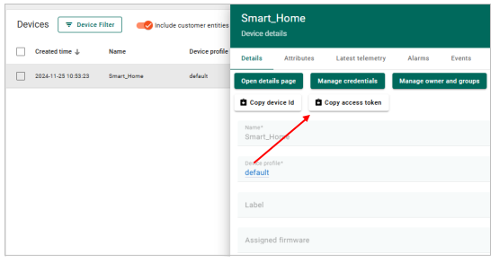
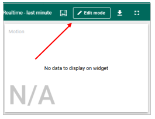
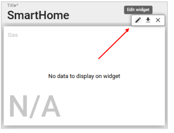
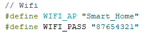

# Pasos para configurar ThingsBoard y programar el ESP32

## 1. Crear una cuenta gratuita en ThingsBoard

- **Crear un correo temporal**:
  
  Visita [Temp-Mail](https://temp-mail.org/es/).
  
  Copia la dirección de correo desechable proporcionada al abrir la página.
  
  

- **Registrar una cuenta en ThingsBoard Cloud**:
  
  Ve a la [página de registro de ThingsBoard Cloud](https://thingsboard.cloud/signup).
  
  Completa los datos requeridos para crear una cuenta.

  

- **Verificar tu correo electrónico**:
  
  Revisa el correo de verificación enviado a la dirección de correo temporal.
  
  

  Haz clic en el botón "Activar tu cuenta".
  
  

- **Inicia sesión en ThingsBoard**:
  
  Después de la activación, haz clic en el botón "Login" para acceder a tu cuenta de ThingsBoard.

---

## 2. Configurar la cuenta de ThingsBoard
- **Crear un dispositivo**:
  
  Navega a **Entities > Devices**.
  
  

  Crea un nuevo dispositivo que representará el hogar inteligente.
  
  

  Asigna un nombre al dispositivo y haz clic en **Add**.
  
  

  Cierra la ventana emergente, haz clic en el dispositivo recién creado y copia el **token de acceso** para vincularlo con tu programa.
  
  

- **Configurar el tablero (Dashboard)**:
  
  Ve a la sección **Dashboards**.
  
  

  Importa un tablero preconfigurado para visualizar parámetros y controlar el hogar inteligente:
  
  
  
  Arrastra y suelta el archivo `smarthome.json` (proporcionado en la carpeta de la clase) en el área indicada.
  
  Haz clic en el botón **Import**.
  
  

  Abre el tablero recién importado (nota: es posible que los datos no se muestren inicialmente).
  
  

  Entra en el **modo de edición** del tablero.
  
  

  Para cada widget, accede a su **editor de propiedades**:
  
  

  Vincula el widget al dispositivo creado anteriormente.
  
  

  Repite este proceso para todos los widgets.
  
  Una vez que todos los widgets estén vinculados al dispositivo, haz clic en **Save**.
  
  

---

## 3. Programar el ESP32 para conectarse a ThingsBoard
- **Crear un punto de acceso WiFi**:
  
  Usa un teléfono móvil con conexión a internet estable para crear un punto de acceso WiFi.
  
  El ESP32 se conectará a este punto de acceso para comunicarse con ThingsBoard.

- **Abrir el código del proyecto**:
  
  Ubica el código `smart-home-project-TB.ino` proporcionado en la carpeta de la clase.
  
  Modifica las siguientes líneas en el código:
  
  Reemplaza el nombre y la contraseña del WiFi con los detalles del punto de acceso que creaste.
  
  

  Actualiza el **token de acceso** con el token del dispositivo creado en ThingsBoard.
    
  

- **Visualizar los datos en el tablero**:
  
  Abre el tablero configurado en ThingsBoard para monitorear los parámetros del hogar y controlarlo.
