# Steps for configuring ThingsBoard and programming ESP32

## 1. Create a free ThingsBoard account
- **Create a temporary email**:
  - Visit [Temp-Mail](https://temp-mail.org/en/).
  - Copy the disposable email address provided when opening the page.
  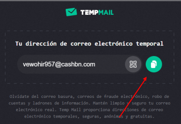

- **Register on ThingsBoard Cloud**:
  - Go to the [ThingsBoard Cloud sign-up page](https://thingsboard.cloud/signup).
  - Fill in the required details to create an account.
  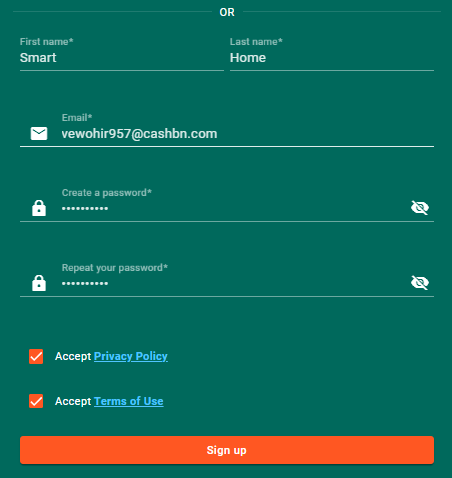

- **Verify your email**:
  - Check the verification email sent to the temporary email address.
  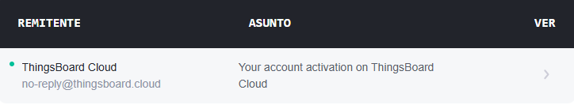

  - Click the "Activate Your Account" button.
  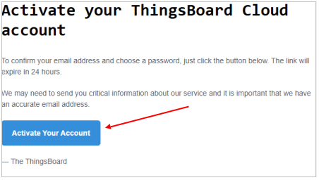

- **Login to ThingsBoard**:
  - After activation, click the "Login" button to access your ThingsBoard account.

---

## 2. Configure the ThingsBoard Account
- **Create a Device**:
  - Navigate to **Entities > Devices**.
  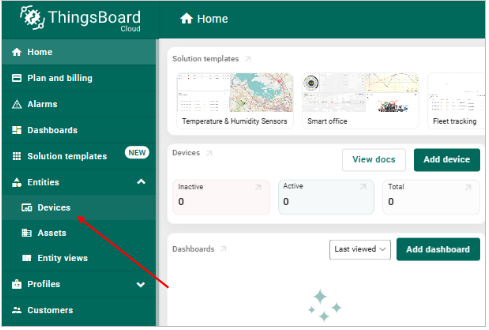

  - Create a new device representing the smart home.
  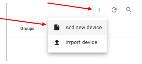

  - Add a name for the device and click **Add**.
  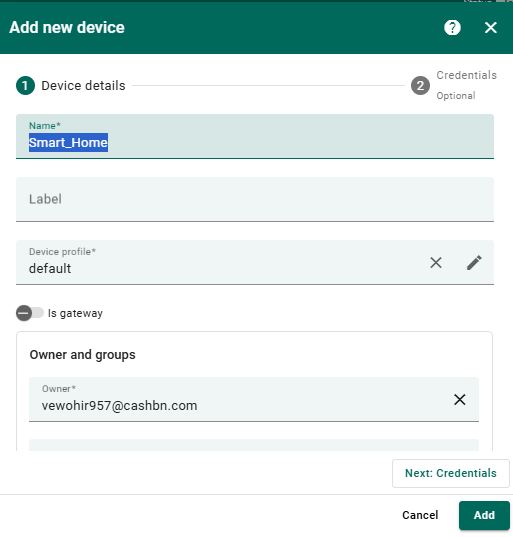

  - Close the pop-up window, click on the newly created device, and copy the **access token** for linking it to your program.
  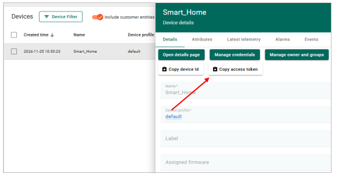

- **Set Up the Dashboard**:
  - Go to the **Dashboards** section.
   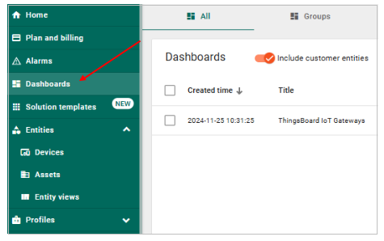

  - Import a pre-made dashboard for visualizing parameters and controlling the smart home:
   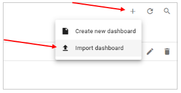

    1. Drag and drop the `smarthome.json` file (provided in the class folder) to the indicated area.
    2. Click the **Import** button.
  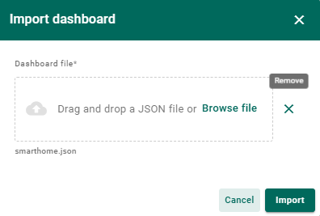

  - Open the newly imported dashboard (note: data may not appear initially).
  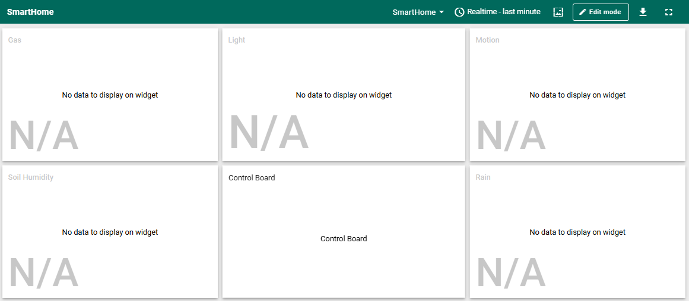

  - Enter the **Edit Mode** of the dashboard.
  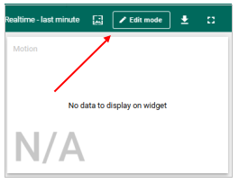

  - For each widget, go to its **property editor**:
  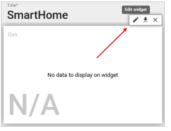

    1. Link the widget to the previously created device.
  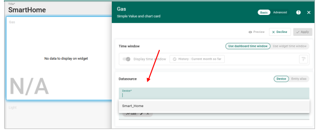

    2. Repeat for all widgets.
  - After linking all widgets to the device, click **Save**.
  

---

## 3. Program the ESP32 to Connect to ThingsBoard
- **Create a WiFi Hotspot**:
  - Use a mobile phone with a stable internet connection to create a WiFi access point.
  - The ESP32 will connect to this hotspot to communicate with ThingsBoard.

- **Open the Project Code**:
  - Locate the `smart-home-project-TB` code provided in the class folder.
  - Modify the following lines in the code:
    1. Replace the placeholder WiFi name and password with the details of the hotspot you created earlier.
    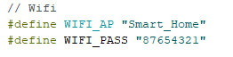

    2. Update the **access token** with the token from the device created in ThingsBoard.
    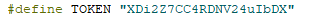

- **Visualize Data on the Dashboard**:
  - Open the configured ThingsBoard dashboard to monitor home parameters and control devices.
